# 100 Days of Python

A 100-day journey to learn Python through **daily practice and small projects**.

## Goal

Learn Python fundamentals, improve problem-solving, and build something small every day.

## Progress
* [x] Day 17 Quiz Game: OOP, Classes, Objects, Open Trivia API, JSON, Dictionary

* [x] Day 16 Coffee Machine 2.0: OOP, Classes, Objects, Abstraction, Inheritance, Encapsulation

* [x] Day 15 Bulbasaur Pokémon Card: Python Turtle, OOP, Angles, Radians, Geometry

Watch the animation video here - https://github.com/user-attachments/assets/4f9f49d1-a32d-4067-9d61-ac10659be686

* [x] Day 14 Coffee Machine: Game State, Control Flow, Math Package

* [x] Day 13 Higher Lower: Python Fundamentals, Lists & Dictionaries, Functions, Game State, Control Flow, Input validation 
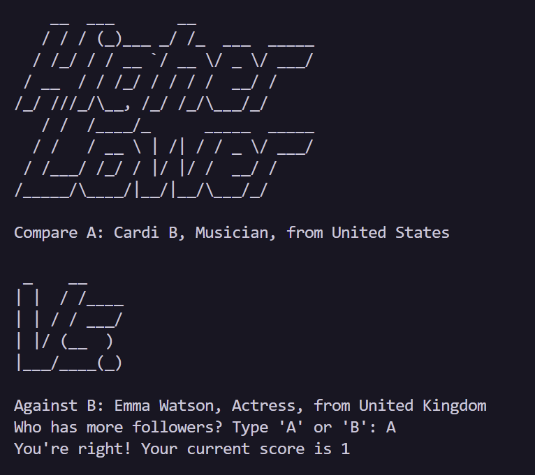
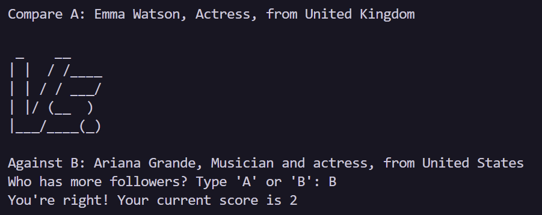

* [x] Day 12 Number Guessing Game: Python Variable Scope, Local and Global Variables
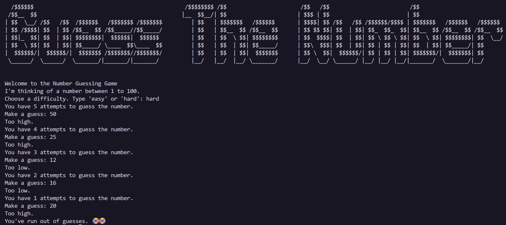

* [x] Day 11 Blackjack: Python Variables, Loops, Functions, Control Flow, Decomposing a problem in functions, State management, Algorithmic Thinking, Flowcharts

* [x] Day 10 Calculator: Python Dictionaries, Function with Outputs, Return statements

* [x] Day 9 Blind Auction: Python Dictionaries

* [x] Day 8 Caesar Cipher: Python Functions, Function parameter
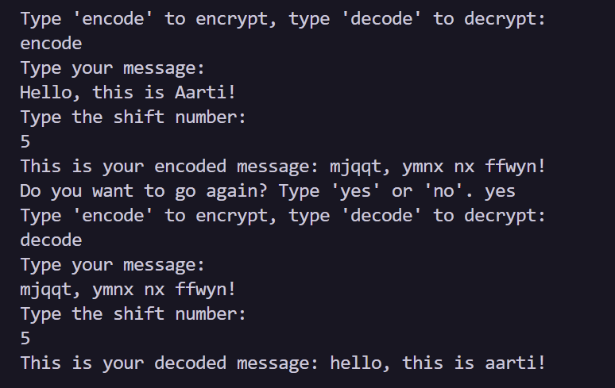

* [x] Day 7 Hangman: Python Loops, Control Flow, Nested Ifs, Randomization, Python List, String Manipulation 
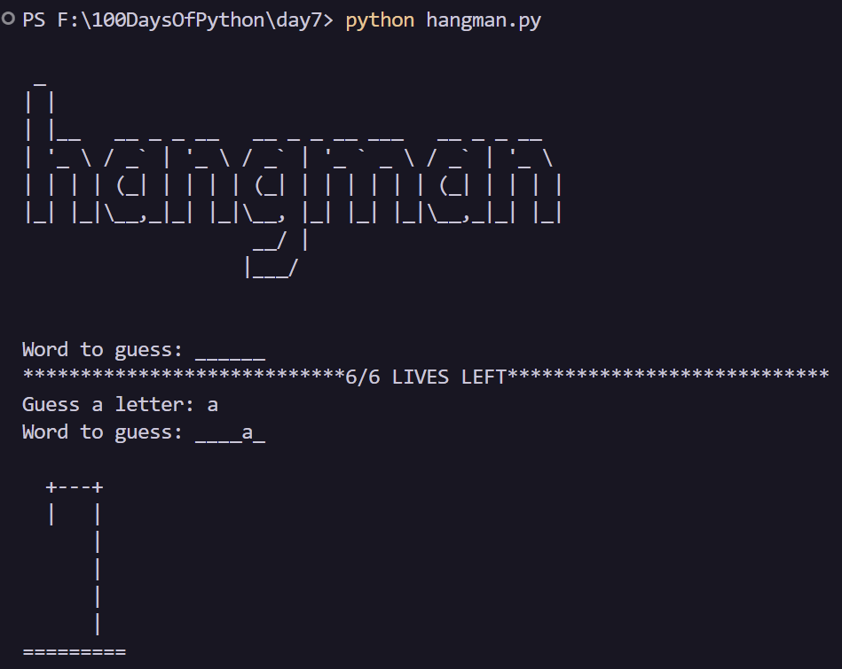

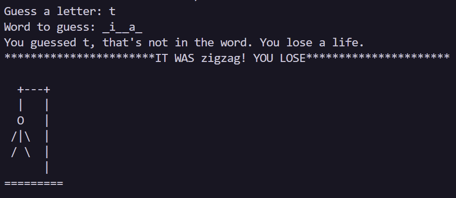

* [x] Day 6 Python Karel: Python Functions

* [x] Day 5 Random Password Generator: Python Loops
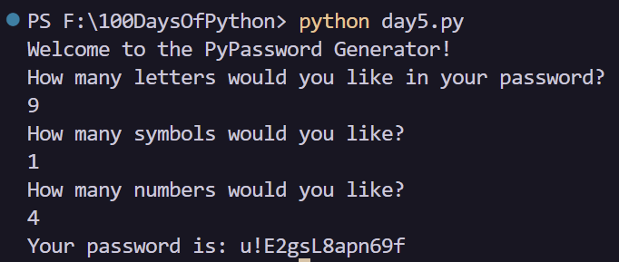

* [x] Day 4 Rock Paper Scissors: Learnt Random module and Python Lists
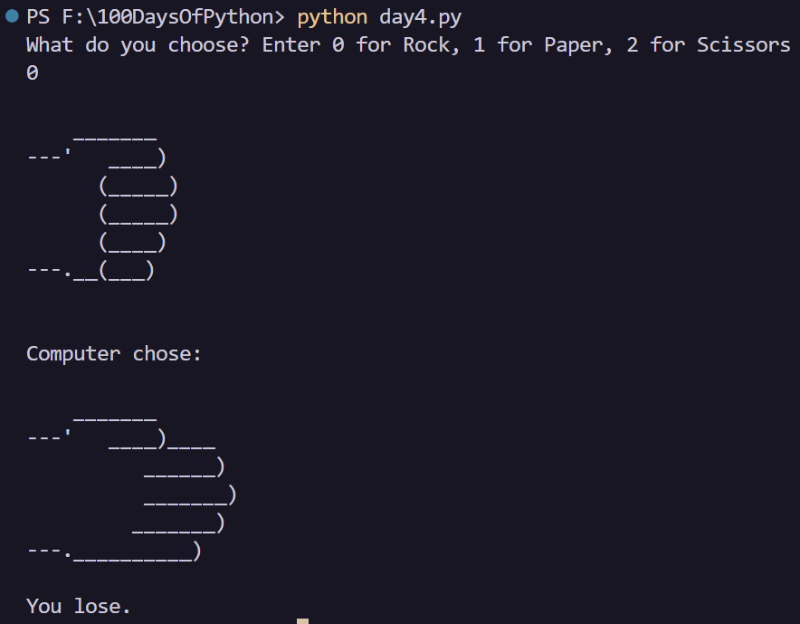

* [x] Day 3 Treasure Island: Learn Control Flow
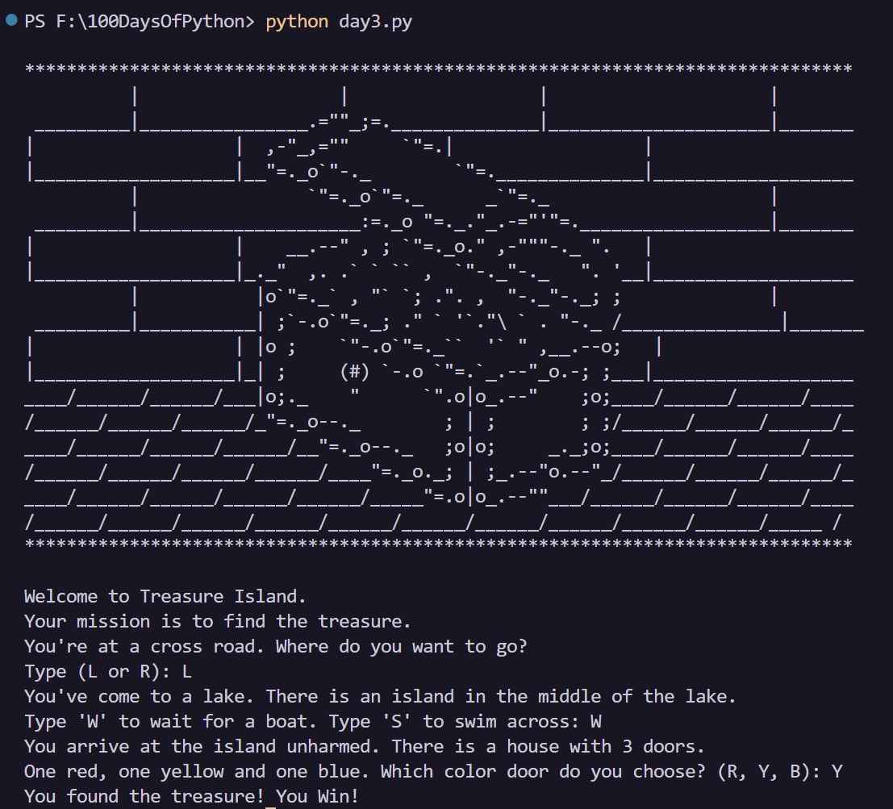
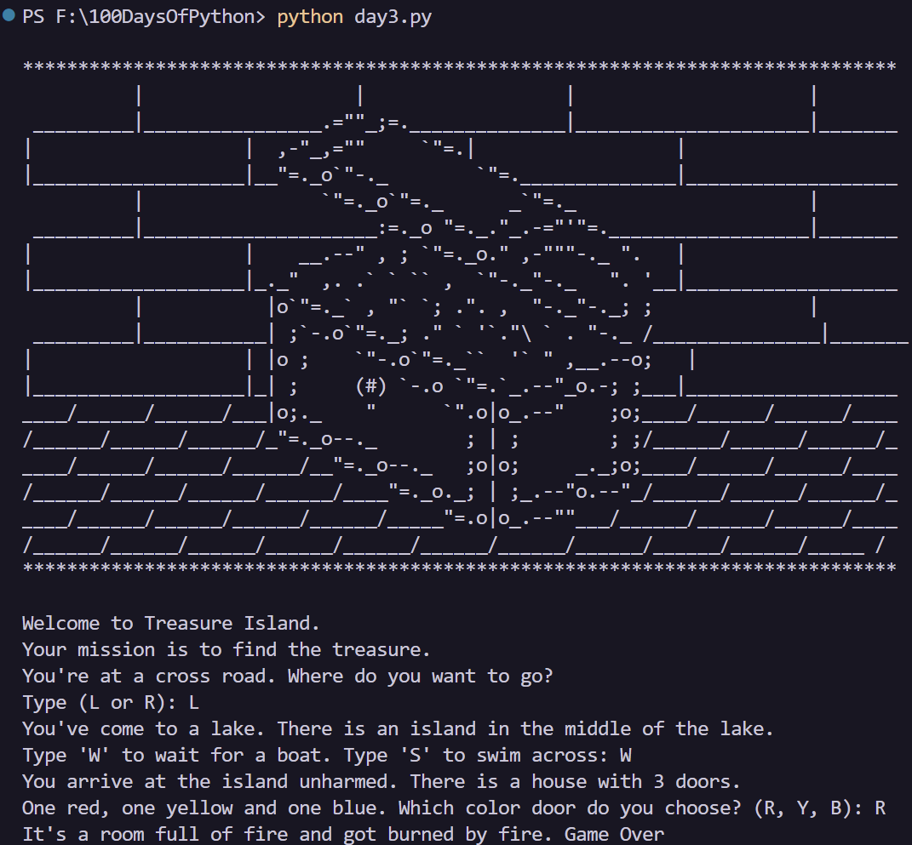

* [x] Day 2 Tip Calcultor: Understanding Data Types and String Manipulation
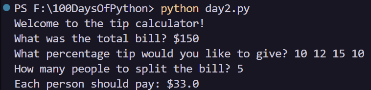

* [x] Day 1 Band Name Generator: Learnt to work with variables
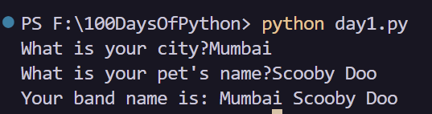

## Daily Rule

**Learn → Practice → Build → Commit**

Every day, learn one concept and use it to build a small project or feature.

## Projects

Each project is kept small enough to finish in a day or two, while gradually increasing in difficulty.

**100 days. 100 lessons. 100 small builds.**
